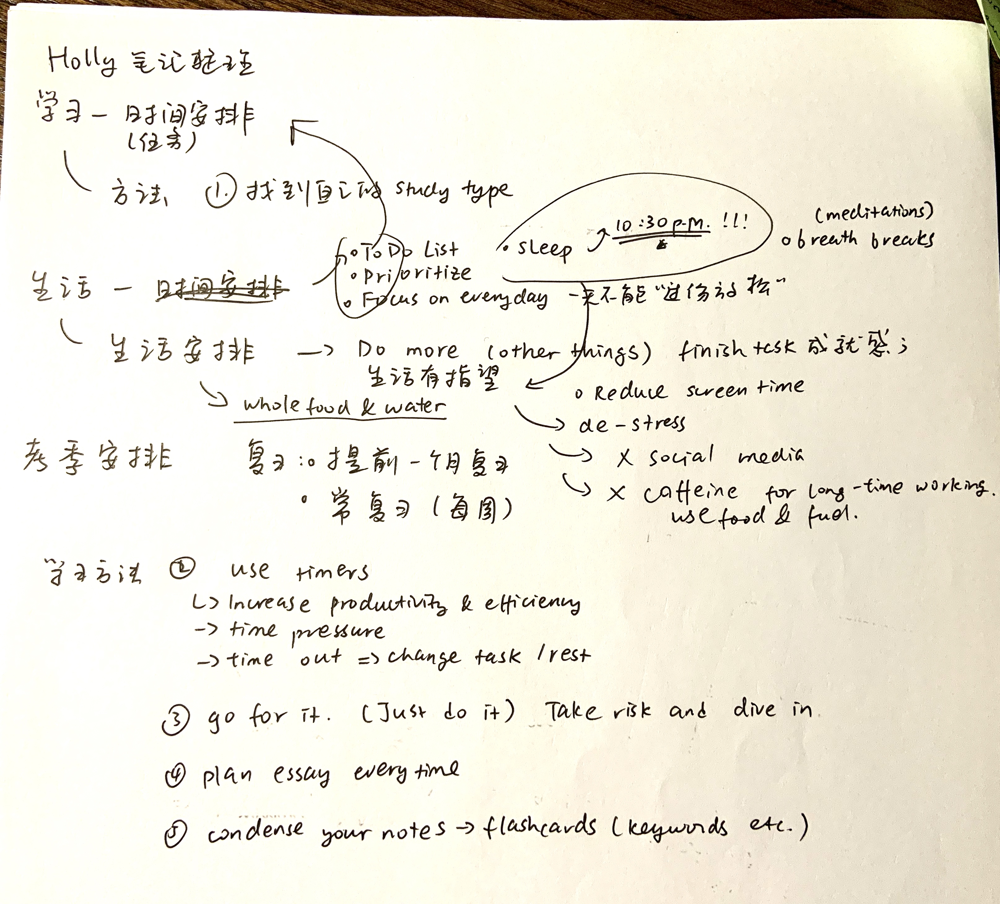

*学习笔记： Holly Garielle, a Youtuber and a Cambridge graduate*

# 学习:     

---

## 学习过程安排     

---

1.【***To Do List***】

2.【***Prioritize***】

所有事情都应该有主次之分。有先后的计划和实施更有效。

3.【***Focus On Everyday***】

专注于每一天的付出。并不存在“认真学习日”亦或“休息日”；每天都应该有条不紊的进行，这样才能保证最健康的发展和进步。有持续性的进步。

4.【**考季**】

提前一个月进行大复习。坚持每周小复习，每天巩固当天所学的知识。不要让复习成为预习！！！

##学习方法 

---

1.【**找到自己的学习方式**】      

每个人适合学习的方式--抄写，应用或是听读。找到属于自己的方式巩固理解知识可以事半功倍。  

2.【**使用计时器**】   

使用计时器可以给自己一个压迫感，这样可以帮助提高效率。    

---在**计时结束**后也**结束**自己手头的任务。换一个任务，这样安排可以帮助提高效率。    

---在**结束后**适当放松，使用【*breath break*】技巧来放松神经       

3.【***Go For It***】

不要等到做好万全准备再开始实施，因为那样会为时太晚。take risk然后下手做吧！在实践中才会遇见很多无法遇见的问题。万事开头难，开始做了，一起都会顺利。   

4.【***Plan Essay Everytime***】    

Plan before you write, such that you may finish your task with higher efficiency and address the need with better accuracy!

5.【**做笔记**】

1.0初始笔记：A4白纸（iPad电子笔记）；记录重点

2.0整理笔记：（iPad电子笔记），总结难点和关键知识，初级复习

3.0复习笔记：整理2.0笔记，凝缩精华。利用flashcards以及便利贴帮助复习巩固体型，概念

# 生活：

---

1.【***Do more Things***】   

给自己多一点task，在完成现有计划的一小部分后转换手头的事情。这样可以创造「成就感」，鼓舞自己继续，并且可以创造「新鲜感」，给自己的“充实学习”生活一个盼头。

2.【**少看屏幕，少看社交媒体**】

少看屏幕，提高专注，改善睡眠

3.【**放松**】

不要给自己太大压力。要敏感察觉自己是否处在不健康的压力下。如果是就适当放松吧。健康第一位。

4.【**不要咖啡因！**】

借助咖啡因来保持长时间学习是非常不明智的决定！这会让你头晕目眩，睡眠质量变差，适得其反！我建议大量饮水，少食多餐，用「 ***whole food*** and ***Water***」来帮助你一整天充满活力！

5.【***Breath Breaks***】

适当休息，哪怕就只是一分钟。在疲倦紧张的工作中抽出一小会「**调整呼吸**」，「**站起来转转**」，甚至「**冥想五分钟**」等等。这样可以有效帮助放松大脑皮层，帮助避免过多学习所带来的没必要的劳累。

一起加油呀呀